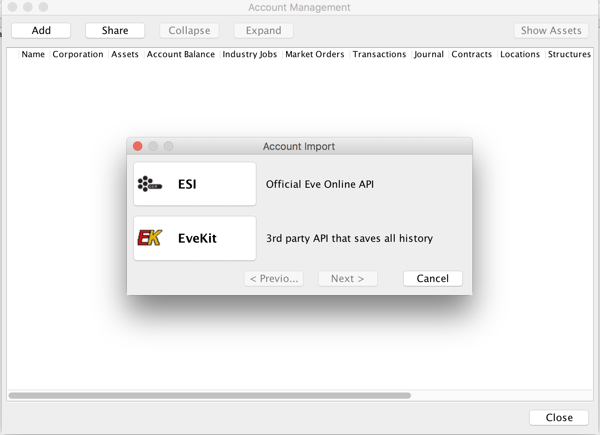
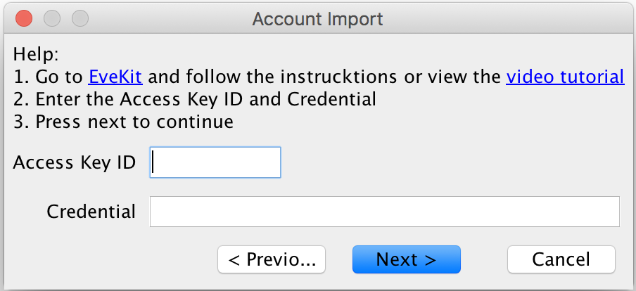
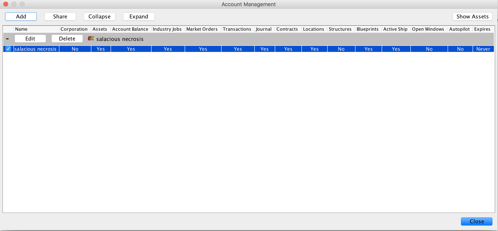
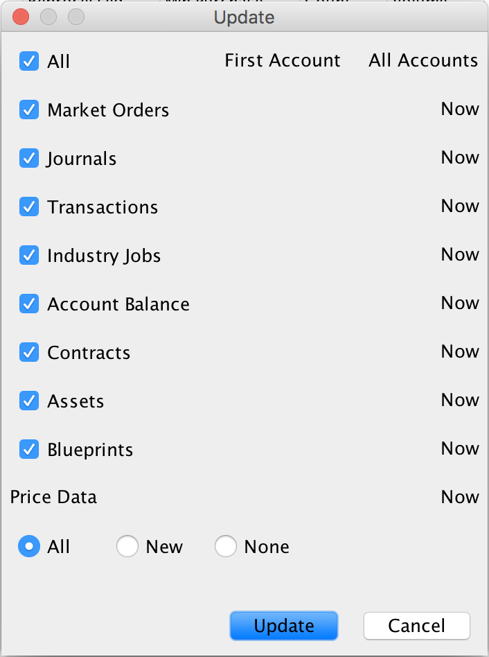
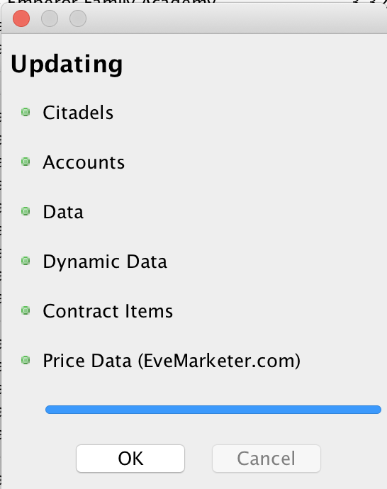
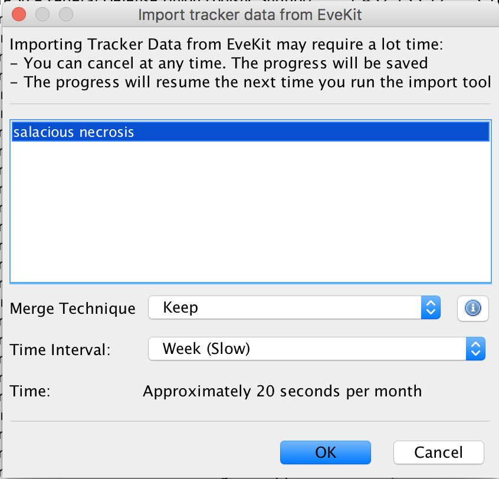

Using EveKit with jEveAssets
===============================

`jEveAssets <https://eve.nikr.net/jeveasset>`_ is an out-of-game management tool
for EVE Online.  This tool is written in Java and is easy to install on most
popular operating systems.  jEveAssets operates on player and corporation data
retrieved from the ESI.  However, jEveAssets can also retrieve data from EveKit.
Using EveKit as the source in place of the ESI ensures that a complete history
of your date is always available to jEveAssets.  Follow the instructions below
to add you EveKit accounts to jEveAssets.  This guide assumes you have successfully
installed jEveAssets.

To add an EveKit account to jEveAssets, you'll first need to record the credentials
of the approriate EveKit data access key.  You can find these credentials in
the :ref:`ui-ModelAccessKeys` section of the appropriate EveKit account.  If you
haven't created a data access key yet, please go ahead and create one, adding the
access masks for the data you would like to make visible to jEveAssets.  You'll
need to note the key ID and hash string for the access key you would like
to import.

Once you have recorded your access key credentials, start jEveAssets and select
Options -> Accounts.  This will cause the following dialog to appear:

Click the "EveKit" button to bring up the EveKit credentials dialog:

Now enter your data access key ID and hash string into the appropriate fields
and click "Next".  jEveAssets will spend a moment validating your key, after
which you can click "OK" to dismiss the dialog.  If all goes well, the
"Account Management" display should look similar to the following:

The columns in this view show data categories you have permissioned jEveAssets
to retrieve.  You can add additional accounts if you wish using the "Add" button.  Click
"Close" when you are finished adding accounts.

EveKit data will automatically be imported then next time you use the "Update"
dialog.  When you select Update -> Update..., you should see a dialog like the following:

Go ahead and click "Update" to initiate data retrieval.  If everything is
working properly, you should see a dialog like the following:

If you close this dialog and pull up some of the jEveAssets tools, you should
see the latest view of whatever data you have chosen to share with jEveAssets
(e.g. asset list, wallet transactions and journal, etc).

The "Update" dialog will always retrieve the latest data from EveKit.
To fully take advantage of EveKit, however, you may want to retrieve historical
data as well.  jEveAssets provides support for historical retrieval using
the "EveKit tracker import" function.  To use this feature, select
Update -> EveKit tracker import.  This will bring up a dialog like the following:

You can choose to import daily, weekly or monthly historical snapshots
merged according to your chosen "Merge Technique".  If you don't have
much history, or your account is not very active, then daily snapshots
should be fine.  Otherwise, you should consider choosing a more
coarse snapshot interval.

jEveAssets is under active development, with most new features including
EveKit support.  You can view the jEveAssets `documentation <https://eve.nikr.net/jeveasset>`_
for further information.

	   

