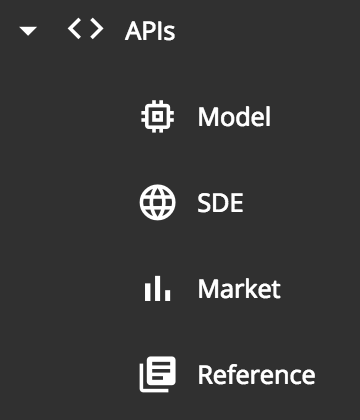
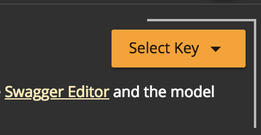

API Screens
===========

Most APIs supported by EveKit can be browsed from the API menu:



The API browser is a thin wrapper over the `Swagger UI <https://swagger.io/tools/swagger-ui/>`_
pointed at the appropriate API configuration file (usually a `swagger.json` file).

The model API provides access to your private character or corporation data, and therefore
requires an EveKit access key.  You can create an access key from the `Account Screen`_
or by following the quickstart procedure (see `Getting Started`_).  All other EveKit APIs
are public and do not require credentials. The `Other Datasets`_ section has additional
information about the other data sets EveKit provides.

Creating an API Client
----------------------

Each API is described by a Swagger configuration file.  A link to the current Swagger
configuration is displayed at the top of the API view for each section
(e.g. ``https://evekit-model.orbital.enterprises/api/swagger.json``).
The easiest way to generate an API client is to use the online `Swagger Editor <https://editor.swagger.io/>`_.
After loading this page, select "File -> Import URL" to import the appropriate
Swagger configuration link.  You can then use the "Generate Client" menu to
generate a client in your favorite language.

If you'd prefer a more programmatic approach, you can use an `online generator <https://github.com/swagger-api/swagger-codegen#online-generators>`_.

If you'd prefer even more control over the generation process (e.g. to provide support for a
new language), you can clone the `Swagger Codegen GitHub Project <https://github.com/swagger-api/swagger-codegen>`_
and build the generator yourself.

Model API
---------

The model API is used to access your EVE Online character and corporation data.
This API requires credentials in the form of an access key ID code and hash.
Normally, you will supply these credentials as parameters to each API call.
However, to make browsing easier, the model API view includes a key selector
in the upper right corner:



Selecting a key using the key selector will pre-populate the appropriate credential
fields in each model API call.

You can test an API call by selecting the 'Try it out' button for the appropriate call.
All model API methods have default arguments which will retrieve the latest
data for the selected endpoint.  You can click the 'Execute' button to make a call.
The result of the call (in JSON format) will be show in the 'Response body' section.

The model API is divided into five sections:

* **Access Key**: these endpoints provide information about a given model access key.
  
* **Character**: these endpoints provide access to character model data.
  
* **Corporation**: these endpoints provide access to corporation model data.
  
* **Common**: these endpoints provide access to data common to both characters and corporations.
  
* **Meta**: these endpoints allow for setting and retrieving meta data associated with model objects.

We describe various features of each section below.

Access Key Endpoints
````````````````````
The two access key endpoints are intended to be used by third party developers who wish to integrate
EveKit into their applications.  These endpoints can be used to discover certain properties
of EveKit access keys such as:

* Whether this key provides access to character or corporation data;

* The names of the character and corporation associated with the key;

* The expiry time of the key (if any);

* The historic query limit of the key (if any);

* The access mask for this key; The mask determines which EveKit data may be access using this key; and,

* Whether the ESI token associated with the key is still valid; Third party applications may wish
  to use this information to alert their users when their EveKit data may have stoped updating due
  to a stale ESI token.
  
Model Data Endpoints
````````````````````

The model data endpoints - character, corporation and common - provide access to account model data.
Each endpoint in this group has the following common argument list:

1. **accessKey (REQUIRED)**: The numeric id for the access key.
   
2. **accessCred (REQUIRED)**: The alphanumeric hash code for the access key.
   
3. **at (OPTIONAL)**: The model lifeline selector.  This argument determines the date range of
   the model data to retrieve.  If omitted, then the current date/time is used.
   
4. **contid (OPTIONAL)**: The continuation ID from which to start returning results.  This argument
   sets the minimum (or maximum if **reverse** is true) "cached data" ID (**cid** - see `EveKit Data Model`_)
   which will be returned in the result set. This argument is used to page through large result sets
   (see below).  If omitted, then results are returned starting from the first result (or last
   result if **reverse** is true) in the result set ordered by cid.
   
5. **maxresults (OPTIONAL)**: The maximum number of results to return.  At time of writing, each endpoint
   will return no more than 1000 results.  You must page through large result sets (see below) to retrieve
   all values.  If omitted, then the maximum number of results allowed are returned.
   
6. **reverse (OPTIONAL)**: If true, then return results in descending order by cid. If omitted,
   then results are returned in ascending order by cid.
   
7. **endpoint specific arguments (OPTIONAL)**: Each endpoint may have zero or more additional arguments.

The access key and credential arguments are required for every call.  The remaining arguments are optional
and control the size and content of the result set.  Each optional argument has a sensible default, but
can also be modified as described below in order to alter the result set.

.. _point-in-time:

Point-in-Time and Historical Results
~~~~~~~~~~~~~~~~~~~~~~~~~~~~~~~~~~~~

A key feature of EveKit is the retention of all history.  To implement this feature, each model object
is versioned and records a time range indicating when the model data was considered current.
This time range is called a "lifeline" and is represented as a half-open interval *[s,e)*. Given a time, *t*,
a model object is live at *t* if *s <= t < e*. The lifeline (**at**) argument allows you to specify *t*, and
thus constrain the result set to only those model objects that were live at *t*.

The lifeline (**at**) argument supports a special query syntax as follows:

* **(omitted)**: if you do not specify a lifeline argument, then *t* is set to the current time. This is
  equivalent to ``{values: [<current time>]}`` as described below.

* **set**: the syntax ``{values: [t1, t2, t3,...]}`` will constrain the result set to model objects
  which were live at any of the times ``t1``, ``t2``, ``t3``, etc.  **NOTE: unless otherwise specified, all
  time arguments in EveKit are numeric values representing milliseconds since the epoch (January 1, 1970, UTC).**

* **range**: the syntax ``{start: s, end: e}`` will constrain the result set to model objects which
  were live at *any* time during the closed interval *[s, e]* (that is, inclusive).

* **all**: the syntax ``{any: true}`` will return all model objects, regardless of lifeline.

Specifying a large time range may require paging the result set as described below.

.. _result-set-filtering:

Result Set Filtering
~~~~~~~~~~~~~~~~~~~~

It is often convenient to filter the result set according to model object properties.  For example,
we might wish to filter the ``/ws/v1/common/blueprint`` endpoint so that only bluesprints with a
specific type ID are returned. To allow for model filtering, each endpoint includes an argument
for each data field stored in a model object.  These arguments can specify a filter using syntax
similar to that described in the previous section:

* **(omitted)**: if you do not specify a filter for a model data field, then that field will not
  be used to constrain the result set.  This is equivalent to the syntax ``{any: true}`` as
  described below.

* **set**: the syntax ``{values: [v1, v2, v3,...]}`` will constrain the result set to model
  objects where the given data field has at least one of the specified values.  If the data
  field has type string, then the value arguments should be enclosed in double quotes
  (e.g. ``{values: ["v1", "v2", "v3", ...]}``). Otherwise, the values will be interepreted
  as either boolean or numeric values as appropriate (see the note above concerning the
  specification of time arguments in EveKit).

* **range**: the syntax ``{start: s, end: e}`` will constrain the result set to the model
  objects where the given data field has a value in the specified range (inclusive).
  It is assumed that *s <= e* as determined by the data field type (e.g. numerical ordering
  for numeric fields, lexicographic ordering for string fields, undefined for boolean fields).

* **string match**: the syntax ``{like: m}`` will constrain the result set to the model
  objects where the given data field is of string type and matches the wildcard
  expression ``m``.  In this case, ``m`` must be a quoted string in a format suitable
  for the SQL ``LIKE`` query.  Such a string may be ``%`` to match any number of characters,
  and ``_`` to match a single character.  See `SQL LIKE <https://www.w3schools.com/sql/sql_like.asp>`_
  for more details.

* **all**: the syntax ``{any: true}`` which will return all model objects, regardless of the
  value of the given data field. Since this case is equivalent to specifying no filter,
  we only present it here for completeness.

The careful reader may notice the similarity to JSON syntax.  This is no coincidence and, in fact,
the syntax for both lifeline (**at**) and model data arguments is indeed just JSON in one of
the formats specified above.

.. _paging-result-sets:

Paging Large Result Sets
~~~~~~~~~~~~~~~~~~~~~~~~

At time of writing, the size of the result set is restricted to 1000 objects.  For larger result
sets, it is necessary to "page" through the results.  This is accomplished by altering the
**contid** argument on subsequent calls.  The following python pseudo code illustrates this process:

.. code:: python

   contid = 0
   # You can set reverse to true if you want descending results
   reverse = false
   results = []
   next = call_endpoint(reverse=reverse, ...)
   while len(next) > 0:
       results.extend(next)
       contid = next[-1].cid
       next = call_endpoint(contid=contid, reverse=reverse, ...)

This code takes advantage of the fact that results are always ordered by the "cached data" ID (cid).
This order will be increasing if ``reverse`` is false, and decreasing otherwise.  Therefore,
the cid of the last object in the result list always gives the upper or lower bound (according
to ``reverse``) for the next results page.

Meta-Data Endpoints
```````````````````
Each model object supports meta-data in the form of a string-valued map (with string-valued keys).  A special
property of this map is that it is preserved when objects are evolved as part of data synchronization.
This allows third party applications to store state tagged to model objects, and have that state preserved
even as the object evolves over time.  This process is described in more detail in :ref:`EveKit Data Model`.

The five meta-data endpoints allow you to read, set or remove meta-data attached to model objects.
At time of writing, each object is limited to 10 meta-data entries.

Static Data Export (SDE) API
----------------------------

The Static Data Export (SDE) API provides online access to the latest `Static Data Export <https://developers.eveonline.com/resource/resources>`_
released by CCP.  EveKit provides access to the two most recent releases.  You can select a release using the
release selector in the upper right corner:


Selecting a release will cause the SDE API browser to appear.

The SDE API is divided into sections that mirror the tables provided by the CCP data file export.  At time of
writing, there were 15 sections.  The SDE API endpoints are similar to the Model API endpoints and consist
of the following argument list:

1. **contid (OPTIONAL)**: The continuation ID from which to start returning results.  This argument
   represents an index into the result set, starting from 0.  Use this argument to page through
   large result sets (see below).

2. **maxresults (OPTIONAL)**: The maximum number of results to return.  At time of writing, each
   endpoint will return no more than 1000 results.  You must page through large result sets (see below)
   to retrieve all values.  If omitted, then the maximum number of results allowed are returned.

3. **endpoint specific arguments (OPTIONAL)**: Each endpoint may have zero or more additional arguments.

SDE API results can be filtered in the same way as described for the model API above.  In particular,
each endpoint specific argument accepts the same filtering syntax as above (e.g. set, range, or
string match filtering).

The following python pseudo code illustrates the retrieval of large result sets:

.. code:: python

   contid = 0
   results = []
   next = call_endpoint(...)
   while len(next) > 0:
       results.extend(next)
       contid += len(next)
       next = call_endpoint(contid=contid, ...)

Note that there is no concept of "reversing" the order of the result set. Results are always
returned in the same order, but can be offset using the "contid" argument.

Market API
----------

The Market API provides online access to regular snapshots of EVE Online market data, including order
books and market history.  The API consists of two components:

1. The *Online API*, described here, is a swagger annotated API much like the APIs described above.  Use this API
   when you need to retrieve a small amount of data.  For example, the order book for Tritanium in Jita
   an hour ago.  Or, the last month of market history for Hulks in Amarr.  The online API is *not*
   efficient for bulk or large volume retrieval.

2. The *Market Data Archive*, described in more detail in the :ref:`market-data-details` section, stores
   daily order book and market history in a format convenient for bulk retrieval.  Use the archive
   when you need larger data sets. For example, all market data for a given day across all EVE regions.

The online API has four simple endpoints:

1. **history**: retrieve market history for a given type, region and date.

2. **book**: retrieve the complete order book for a given type, region and date.

3. **livebook**: retrieve the latest order book for a given type and region.

4. **livestructure**: retrieve the latest order book for a given type and a limited set of player-owned structures.
   At time of writing, we record book data from the four highest market bolume structures, which are:

   a. **1022409209010**: Hek - IChooseYou Trade Hub
   b. **1023164547009**: Perimeter - - IChooseYou Trade Hub 
   c. **1023968078820**: Ashab - Port Royal - EVE-Mogul
   d. **1023075604524**: Perimeter - ♔ Planet V ☣Panfam Secured Hub☣ 

   This list is subject to change.  Check the market data API page for the latest list.

Type and region arguments are the numeric IDs for these entities, which you can retrieve from the SDE
(see previous section). Date arguments can either be milliseconds since the epoch (January 1, 1970 UTC)
or any date parseable by the `Javascript Date <https://developer.mozilla.org/en-US/docs/Web/JavaScript/Reference/Global_Objects/Date>`_ class.

Market history represents a daily summary and is normally not available until several hours after
the end of the previous day.  Order book data is snapped regularly throughout the day in
five minute intervals.  The snap frequency is set by the cache timers enforced by the
`EVE Swagger Interface (ESI) <https://esi.evetech.net/ui>`_.

Although we make it possible to get the latest order book data for some player-owned structures,
we do not yet, at time of writing, process player-owned market data into files in the market data
archive.

Reference API
-------------

The Reference API provides access to certain reference data provided by the ESI.  Specifically:

* **alliances**: these endpoints provide access to the list of alliances and their membership.

* **faction**: these endpoints provide access to faction warfare statistics.

* **server**: this endpoint provides access to server status.

* **sovereignty**: these endpoints provide access to the sovereignty map, structures, and campaigns.

While the ESI already provides live access to this data, EveKit goes one step further
and retains a history for this data, similar to the way history is retained for character
and corporation data.

The Reference API is public and does not require credentials for access.  Endpoints are structured
similar to the model API with the exclusion of credential arguments:

1. **at (OPTIONAL)**: The lifeline selector.  This argument determines the date range of
   the reference data to retrieve.  If omitted, then the current date/time is used.
   
2. **contid (OPTIONAL)**: The continuation ID from which to start returning results.  This argument
   sets the minimum (or maximum if **reverse** is true) "cached data" ID (**cid** - see `EveKit Data Model`_)
   which will be returned in the result set. This argument is used to page through large result sets
   (see below).  If omitted, then results are returned starting from the first result (or last
   result if **reverse** is true) in the result set ordered by cid.
   
3. **maxresults (OPTIONAL)**: The maximum number of results to return.  At time of writing, each endpoint
   will return no more than 1000 results.  You must page through large result sets to retrieve
   all values.  If omitted, then the maximum number of results allowed are returned.
   
4. **reverse (OPTIONAL)**: If true, then return results in descending order by cid. If omitted,
   then results are returned in ascending order by cid.
   
5. **endpoint specific arguments (OPTIONAL)**: Each endpoint may have zero or more additional arguments.

Point-in-time and historical queries are accomplished with the same syntax presented
in :ref:`point-in-time`.  Likewise, endpoint specific arguments may be used as filters
as described in :ref:`result-set-filtering`.  Finally, large result sets can be paged
using the technique described in :ref:`paging-result-sets`.

