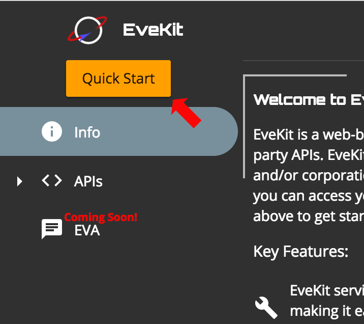

Getting Started
===============

Getting started with EveKit is as easy as clicking on the "QuickStart" button on the main page:

The quickstart process will walk you through the following steps:

1. **Login:** The first step is to authenticate to EveKit using one of the supported authentication
   services:
   
   .. image:: quickstart_login.png
      :scale: 40%
      :alt: Login to EveKit
      :align: center
   |
   
   All EVE accounts you ask EveKit to store will be associated
   with the user you authenticate as in this step.  Note that your login credentials *are not*
   used to authenticate with the ESI servers for retrieving account data.  The credentials needed
   for ESI authentication are provided in step 3.
::

2. **Create Account:** The next step is to create your first EveKit account.  Select the
   'Create Account' button, type in a name for your new account, then specify whether this will be
   a 'CHARACTER' account (an account which records EVE character information), or a
   'CORPORATION' account (an account which records EVE corporation information):

   |
   .. image:: quickstart_choose_account.png
      :scale: 40%
      :alt: Create EveKit Account
      :align: center
   |
   
   Account names
   may be composed of letters, digits or underscores, and can be modified later as needed.
   The account type (character or corporation) **can not** be changed once specified.  If you make a
   mistake, you can always delete the account and create a new one.  If this is not your first
   account, you may notice that it is also possible to select an existing account.  You can
   ignore that option for now, we'll cover it later in this section.
::

3. **Set ESI Token:** Your new account needs an ESI token which allows EveKit to access your
   data.  Click on the 'Add Token' button to start the ESI token dialog:

   |
   .. image:: quickstart_add_token.png
      :scale: 40%
      :alt: Set ESI Token
      :align: center
   |
   
   This dialog allows
   you to select all scopes which should be made available to EveKit.  Next to each
   scope name is a description of the data which can be accessed using that scope.  You can
   select as many scopes as you like.  Note that you can revoke your tokens from EveKit at
   any time using the `ESI Token Management Site <https://community.eveonline.com/support/third-party-applications/>`_.
   Once you are satisfied with your scope
   selection, click the 'Add Credential' button to start the authentication flow with
   EVE Online.  This flow allows you to select which EVE Online character will be used for access.
   You can also verify the scopes you are making available to EveKit.

   If you complete the authentication flow successfully, you will return to the EveKit site where
   step 3 will now look as follows:

   |
   .. image:: quickstart_token_set.png
      :scale: 40%
      :alt: Token Is Set
      :align: center
   |
   
   If you're satisfied with your scope selection, click the 'Skip' button.  Otherwise, you can
   select 'Change Scopes' to change your scope selection.
::

4. **Create Access Key (optional):** At this point, EveKit will start collecting data
   for your new account.  If you'd like to access your data, however, either through
   the EveKit main page or via a third party library, then you'll need to create a
   data access key:

   |
   .. image:: quickstart_access_key.png
      :scale: 40%
      :alt: Token Is Set
      :align: center
   |
   
   Click the 'Create New Data Access Key' button to get started.  Just like ESI scopes, EveKit
   allows you to permission access keys so that only certain account data is accessible to
   the user of the key.  You'll need to specify a name for the key (letters, digits, or
   underscores), a date when the key will expire (or 'Never'), a date which limits the
   how far back someone can look at account data (or 'Unlimited' - more on this below),
   and, finally, the set of permissions to assign to the key.  Next to each permission is
   a list of the data allowed by the given permission.  When you're satisfied with your
   selections, click 'Save Key'.

Congratulations!  You've just created your first EveKit account!  Clicking the 'Finish'
key will take you back to the EveKit landing page.  If you'd like to create more accounts,
you can run the quickstart process again.  There is also an 'Add New...' option under
the 'Accounts' menu section.

Frequently Asked Questions about Account Creation
-------------------------------------------------

**How many accounts can I create?**
    At present, there is no limit on the number of accounts which can be associated with
    a login.  We may impose a limit in the future if this is abused.

**How many access keys can I create?**
    At present, there is no limit on the number of access keys which can be attached to
    an account.  We may impose a limit in the future if this is abused.

**How long does it take to start collecting data for my account?**
    At current loads, a new account will start collecting data about ten minutes after
    the ESI key is set.

**I messed up an account, how do I fix it?**
    The easiest way to start over is to delete the unwanted account and create a new one.
    You can delete an existing account by selecting the account name in the
    'Account' menu.  Click the trash can icon in the summary view and confirm you
    want to delete the account.  To prevent accidents, EveKit will not actually
    remove the account for 24 hours.  You can restore the account at any time
    before then.

**I want to use the same account name for an account I just deleted.  How do I do that?**
    You'll need to rename the account you just deleted.  You can do that by first
    restoring the deleted account: go to the summary view for the account 
    and click the red trash can with the up arrow.  This will restore the account.
    Now click the rename button (pencil icon) and change the name of the account.
    The previous account name is now usable for new accounts.  You can now delete the
    old account again.

