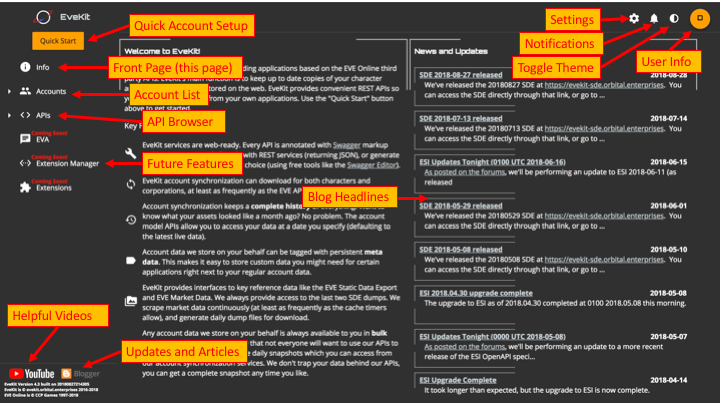

Interface Overview
==================

The following figure highlights key parts of the EveKit interface (after login):

The left side of the interface contains the navigation menu.  This menu wil change
over time as new features are added to EveKit.  The 'Accounts' section will list
any accounts you add to EveKit.  The 'APIs' section will allow you to browse
your account data, as well as other data EveKit provides (such as the Static Data
Export, reference data, and market data).  The API browser is just a wrapper
around the `Swagger UI <https://swagger.io/tools/swagger-ui/>`_.  That is, browsing
the APIs consists of making REST calls via the Swagger UI.  The center portion of
the interface always displays the currently selected menu entry.

The top right portion of the interface allows access to configuration settings, any
notifications provided by the EveKit backend, as well as access to information about
the currently logged in user.  This interface is described in more detail in
the `Settings, Notifications, and User Information <account_view.html>`_ section.

Finally, links on the lower left of the interface allow easy access to the EveKit
YouTube channel, and our blog.

